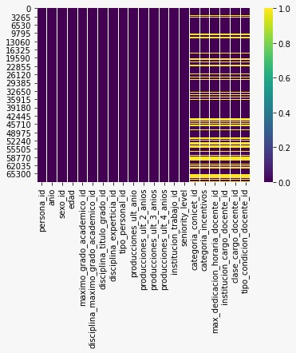

> Este material retoma material de [Bioinfo UNQ](https://github.com/AJVelezRueda/Bioinfo_UNQ/tree/master/Trabajos_Practicos/Estadistica_con_pandas) y [Python_for_friends](https://github.com/jennifergc/Python_for_friends/tree/Angie)


### Introducción a la Ciencia de Datos con Python

Para este recorrido necesitarás las librerías [Pandas](https://pandas.pydata.org/), [Seaborn](https://seaborn.pydata.org/) y [Scipy](https://www.scipy.org/)


Podes corroborar si las tienes instaladas corriendo las siguientes líneas en tu intérprete de Python:

```python
import pandas as pd
import seaborn as sns
import scipy.stats as ss
```

Si correr estas lineas no tira ningún error, etonces están felizmente instaladas las bibliotecas enc uestión. De lo contrario, obtendremos un mensaje de error `ModuleNotFoundError: No module named` al correr las lineas anteriores. En tal caso, podés instalar las bibliotecas desde la consola, con el comando:

```bash
        pip install pandas
        pip install seaborn
        pip install scipy
```

En este recorrido trabajaremos sobre los datos abiertos del sobre el personal del [Ministerio de Ciencia y Tecnología](https://datasets.datos.mincyt.gob.ar/dataset/personal-de-ciencia-y-tecnologia/archivo/11dca5bb-9a5f-4da5-b040-28957126be18) del Gobierno Argentino. 

Si bien no es estrictamente necesario saber a fondo la sintaxis de Python para comenzar a utilizar Pandas, te recomendamos fuertemente realizar el [recorrido introductorio de Python](https://github.com/AJVelezRueda/UCEMA_Fundamentos_de_informatica/blob/master/Python_intro/intro_python_tutorial.md), que te brindará los conocimientos básicos de programación en general y de Python particular que te permitiran abordar este contenido sin problemas.

# Guias de Trabajo
 * [1. Carga e inspección de datos](#1-carga)
 * [2. Tratamiento de datos faltantes](#2-faltantes)


[1. Tratamiento de Datos con Python](#1-carga)

El primer paso para poder analizar los datos y sacar conclusiones de ese análisis es realizar una
limpieza de los mismos... ¡claro que no vamos a pasarle el plumero para sacarle el polvo! Limpieza de datos se refiere por ejemplo a verificar si faltan datos o si a alguna de las columnas debe hacerseles una corrección de notación o de tipo de dato, etc.

Para ello vamos a recurrir a alguno de los métodos que vimos en la [guía introductoria](https://github.com/flbulgarelli/recursos-python/blob/master/2_Ciencia_de_datos_pandas/Introducci%C3%B3n_pandas.md). Para comenzar descargaremos localmente la [tabla](https://datasets.datos.mincyt.gob.ar/dataset/personal-de-ciencia-y-tecnologia/archivo/11dca5bb-9a5f-4da5-b040-28957126be18) de personas que conforman el Ministerio de Ciencia y Tecnología de Argentina, en formato csv. Podemos cargar (leer) la el contenido del archivo en un DataFrame de Pandas de nombre `personas`

```python
import pandas as pd
personas =  pd.read_csv("personas_2011_cyt.csv", sep=";")
personas.head()
```

> Para pensar 🤔: Al imprimir el DataFrame se ven celdas con valores `NaN` ¿Qué son esos valores?¿Qué significa? ¿A qué columna corresponden estos valores? ¿Qué tipo de datos son los pertenecientas a cada una de las columnas (categóricos o numéricos)?

Podemos obtener la información general del DataFrame haciendo:


```python
personas.info()
```

<details>
  <summary>Resultado</summary>

```python
<class 'pandas.core.frame.DataFrame'>
RangeIndex: 68552 entries, 0 to 68551
Data columns (total 21 columns):
 #   Column                                Non-Null Count  Dtype  
---  ------                                --------------  -----  
 0   persona_id                            68552 non-null  int64  
 1   anio                                  68552 non-null  int64  
 2   sexo_id                               68552 non-null  int64  
 3   edad                                  68552 non-null  int64  
 4   maximo_grado_academico_id             68552 non-null  int64  
 5   disciplina_maximo_grado_academico_id  68552 non-null  int64  
 6   disciplina_titulo_grado_id            68552 non-null  int64  
 7   disciplina_experticia_id              68552 non-null  int64  
 8   tipo_personal_id                      68552 non-null  int64  
 9   producciones_ult_anio                 68552 non-null  int64  
 10  producciones_ult_2_anios              68552 non-null  int64  
 11  producciones_ult_3_anios              68552 non-null  int64  
 12  producciones_ult_4_anios              68552 non-null  int64  
 13  institucion_trabajo_id                68552 non-null  int64  
 14  seniority_level                       68552 non-null  object 
 15  categoria_conicet_id                  48640 non-null  float64
 16  categoria_incentivos                  48640 non-null  float64
 17  max_dedicacion_horaria_docente_id     48640 non-null  float64
 18  institucion_cargo_docente_id          48640 non-null  float64
 19  clase_cargo_docente_id                48640 non-null  float64
 20  tipo_condicion_docente_id             48640 non-null  float64
dtypes: float64(6), int64(14), object(1)
memory usage: 11.0+ MB
```
</details>

Como verás esta es una descripción genérica de nuestro DataFrame, de la cuál podemos obtener el nombre de cada columna (variable), el tipo de datos correspondiente a cada una de ellas, y cuántas filas por columna poseen información.

Sin embargo, el análisis de los datos implica hacernos preguntas sobre la información que estos contienen e intentar encontrar respuestas, dentro de lo posible que sean generalizables. Aquí es donde entra en juego 🥁...¡Si: La estadística!

Podemos hacer un primer análisis estadístico básico de nuestro conjunto de datos utilizando el método `describe()`:

```python
personas.describe()
```

> Para pensar 🤔: ¿Qué datos nos devuelve el método `describe()`? ¿Qué significan estos valores?¿Son útiles para todas las columnas?

De la inspección general de los datos y su análisis estadístico básico podemos decir, por ejemplo, que el promedio de edades es de 38 años ¿Pero podemos decir que el promedio de maximo_grado_academico_id es 3? Bueno, es claro que el máximo grado académico habla de cual es el nivel más alto de estudios que logró cada persona (primario, secundario, universitario, etc) por lo que 3 no tiene ningún sentido en este caso. Pero aún reemplazando las palabras correspondientes a cada identificador, un promedio no tiene sentido alguno para esta variable. 

Sin embargo, nos puede interesar saber cuál es el grado de formación que tiene el personal ¿Son mayormente universitarixs? ¿mayormente terminaron el secundario? Para ello podemos calcular la frecuencia de aparición de cada una de estas categorías/datos. Esto es contar cuántas veces del total de filas aparece cada una de ellas:

```python
personas['maximo_grado_academico_id'].value_counts()
```

>🧗‍♀️ Desafío I: Tomando las [tablas de referencia del MinCyT](https://datasets.datos.mincyt.gob.ar/dataset/personal-de-ciencia-y-tecnologia/archivo/11dca5bb-9a5f-4da5-b040-28957126be18) y tomando lo aprendido en el [recorrido anterior](https://github.com/flbulgarelli/recursos-python/blob/master/2_Ciencia_de_datos_pandas/Introducci%C3%B3n_pandas.md), incorporá los datos correspondientes a todas las variables categóricas de la tabla

[2. Tratamiento de datos faltantes](#2-faltantes)
No hace falta suspicacia para prever que en esta sección hablaremos de los datos faltantes. Obtivimos anteriormente, con el método `info()`, cuántos valores no nulos posee cada columna. 

Ahora nos vamos a enfocar en el vaso medio vacío, vamos a intentar cuantificar cuántas celdas hayen nuetsra tabla sin información. Probemos el siguiente código:

```python
personas.isnull().sum()
```

<details>
  <summary>Resultado</summary>

```python
persona_id                                  0
anio                                        0
sexo_id                                     0
edad                                        0
maximo_grado_academico_id                   0
disciplina_maximo_grado_academico_id        0
disciplina_titulo_grado_id                  0
disciplina_experticia_id                    0
tipo_personal_id                            0
producciones_ult_anio                       0
producciones_ult_2_anios                    0
producciones_ult_3_anios                    0
producciones_ult_4_anios                    0
institucion_trabajo_id                      0
seniority_level                             0
categoria_conicet_id                    19912
categoria_incentivos                    19912
max_dedicacion_horaria_docente_id       19912
institucion_cargo_docente_id            19912
clase_cargo_docente_id                  19912
tipo_condicion_docente_id               19912
dtype: int64
```
</details>


Podemos hacer esta inspección de los datos de forma visual:

```python
import seaborn as sns

sns.heatmap(personas.isnull(), cmap='viridis')
```




>
> Para pensar 🤔: ¿Cuáles son las columnas con valores nulos? ¿Coinciden con las que tenían valores `NaN`?¿Qué obtenemos cuándo hacemos `isnull()`?
>
>  🧗‍♀️ Desafío II: Calcular el porcentaje del total de datos, representan los datos nulos de cada columna (variable)
>

Los datos faltantes pueden alterar el análisis de datos ya que disminuyen el tamaño de las muestras y, por tanto, la potencia de los tests estadísticos. Por ello, resulta necesario hacer un tratamiento de los datos faltantes, previo al análisis de los datos. Existen distintos modos de trabajar con los datos faltantes, dependiendo mayormente de nuestro lote de datos y de la variable en cuestión. 

Pero antes de tomar cualquier decisión, cabe preguntarse algunas cosas: ¿Qué información me aporta cada una de las columnas con datos faltantes? ¿Qué tipo de datos son los pertenecientas a cada una de las columnas (categóricos o numéricos)?¿Es relevante dicha variable para el análisis global de los datos? Será entonces, según estas respuestas a estas preguntas que decidiremos alguno de los modos de acción que detallaremos a continuación.

Una de las soluciones posibles para el tratamiento de los datos faltantes es la eliminación de casos completos, es decir eliminar toda las filas que contienen un dato faltante:

```python
personas.dropna(inplace=True) 
```

O aquellas que tienen más de un dato faltante:

```python
personas.dropna(thresh=2, inplace=True)
```

>
> Para pensar 🤔: ¿Qué desventajas crees que tiene esta forma de lidiar con los datos faltantes?¿Cuándo lo usarías?
>

<details>
  <summary>Comentarios</summary>
Esta forma de tratar los faltantes introduce sesgo y reduce el tamaño muestral. 
</details>

Otra solución posible para el tratamiento de datos faltantes sería la eliminación por columna:

```python
personas.drop(['maximo_grado_academico_id'], axis=1, inplace=True)
```

>
> Para pensar 🤔: ¿Qué desventajas crees que tiene esta forma de lidiar con los datos faltantes?¿Cuándo lo usarías?
>

<details>
  <summary>Comentarios</summary>
Produce muestras heterogéneas
</details>